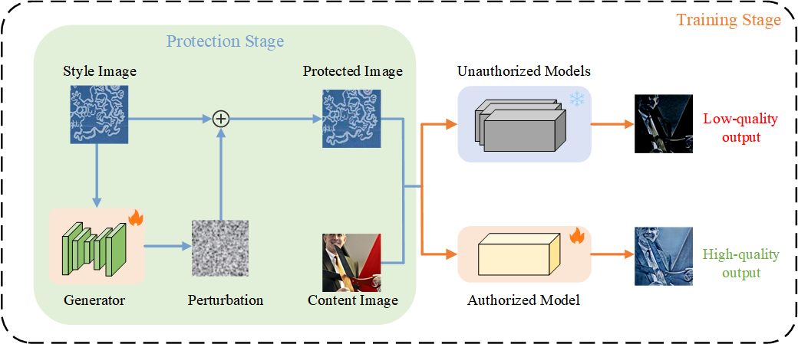

# Using My Artistic Style? You Must Obtain My Authorization
ECCV 2024 [Paper](https://link.springer.com/chapter/10.1007/978-3-031-73016-0_18)  
A framework for artistic style protection. Our code is based on AdaAttN(https://github.com/Huage001/AdaAttN)  
# Pipeline

